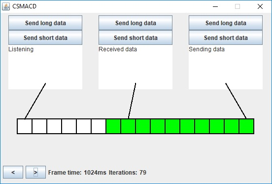
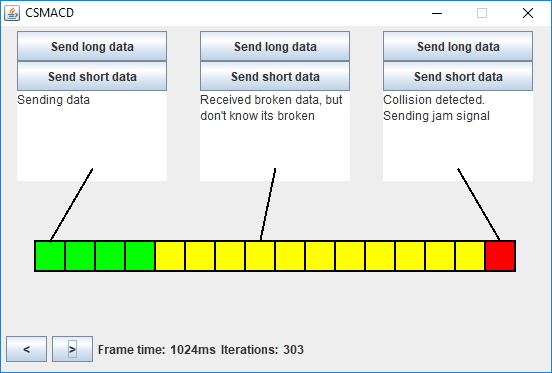

# CSMA/CD Simulation

# Introduction

CSMA/CD media access control using Java and Swing.

Project created for Network Technologies course.

Computer Science, WPPT, Politechnika Wrocławska.

## Usage
```
java Main cableLength mountPoint1 mountPoint2 ...
```

# Screenshots





Run using
```
java Main 16 0 7 15
```
